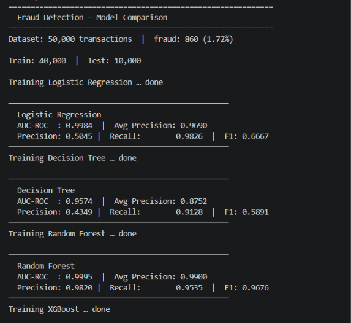
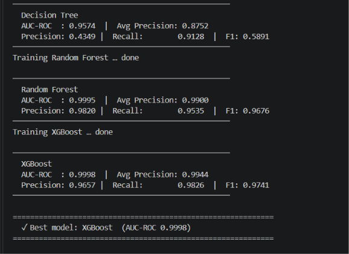

# FraudGuard AI — Real-Time Fraud Detection API

> 🌐 **Live Showcase:** [fraudguard-ai.claude.ai](https://claude.ai/artifact/YFMMv9BjvvhC9ZtBByxowF)

A production-grade real-time transaction fraud scoring API built with **FastAPI**, **XGBoost**, and **SHAP-based AI explanations**. Trained on 50,000 transactions across 4 models — XGBoost auto-selected as the best performer. Every decision is logged to an immutable audit trail for compliance.

---

## Model Comparison Results

Four classifiers were trained and evaluated on 50,000 realistic transactions (1.72% fraud rate).




| Model | AUC-ROC | Avg Precision | Precision | Recall | F1 |
|---|---|---|---|---|---|
| Logistic Regression | 0.9984 | 0.9690 | 0.5045 | 0.9826 | 0.6667 |
| Decision Tree | 0.9574 | 0.8752 | 0.4349 | 0.9128 | 0.5891 |
| Random Forest | 0.9995 | 0.9900 | 0.9820 | 0.9535 | 0.9676 |
| **XGBoost ✓** | **0.9998** | **0.9944** | **0.9657** | **0.9826** | **0.9741** |

**✓ Best model: XGBoost (AUC-ROC 0.9998)** — auto-selected for production deployment.

---

## Architecture

```
┌──────────────────────────────────────────────────────────┐
│                        Client                            │
│          (Bank system / Payment gateway / curl)          │
└──────────────────────────┬───────────────────────────────┘
                           │ POST /transactions/score
                           ▼
┌──────────────────────────────────────────────────────────┐
│                  FastAPI  (main.py)                      │
│  ┌────────────────────────────────────────────────────┐  │
│  │               Router  (routes.py)                  │  │
│  │  POST /transactions/score   ← score a transaction  │  │
│  │  GET  /transactions/{id}    ← retrieve result      │  │
│  │  GET  /transactions/{id}/audit ← compliance log    │  │
│  │  GET  /transactions         ← list / filter        │  │
│  │  GET  /dashboard/stats      ← live KPIs            │  │
│  │  GET  /models/compare       ← model comparison     │  │
│  └───────────────┬────────────────────────────────────┘  │
│                  │                                        │
│  ┌───────────────▼────────────────────────────────────┐  │
│  │           ML Predictor  (predictor.py)             │  │
│  │   XGBoost → fraud probability (0–1)                │  │
│  │   SHAP TreeExplainer → top risk factors            │  │
│  └───────────────┬────────────────────────────────────┘  │
│                  │                                        │
│  ┌───────────────▼────────────────────────────────────┐  │
│  │         CRUD layer  (crud.py)                      │  │
│  │   Persist scores · Audit logs · Dashboard stats    │  │
│  └───────────────┬────────────────────────────────────┘  │
│                  │  SQLAlchemy ORM                        │
│  ┌───────────────▼────────────────────────────────────┐  │
│  │       Database  (SQLite dev / PostgreSQL prod)      │  │
│  └────────────────────────────────────────────────────┘  │
└──────────────────────────────────────────────────────────┘
```

---

## Tech Stack

| Layer | Technology |
|---|---|
| API framework | FastAPI 0.115+ |
| ML model | XGBoost (auto-selected from 4 models) |
| AI explainability | SHAP (TreeExplainer) |
| ORM | SQLAlchemy 2.0 |
| Validation | Pydantic v2 |
| Database | SQLite (dev) / PostgreSQL (prod) |
| Tests | pytest + FastAPI TestClient (19 passing) |

---

## Quick Start

```bash
git clone https://github.com/alansha1/fraud-detection.git
cd fraud-detection
pip install -r requirements.txt

# Train the model (run once)
python model/train.py

# Start the API
uvicorn app.main:app --reload
```

Open **http://localhost:8000/docs** for the interactive Swagger UI.

---

## API Reference

### Score a transaction

```bash
POST /api/v1/transactions/score
```

```json
{
  "transaction_id": "txn_001",
  "amount": 2499.99,
  "currency": "EUR",
  "merchant_category": "electronics",
  "country": "NG",
  "hour": 3,
  "foreign_tx": true,
  "velocity_1h": 7,
  "amount_vs_avg": 4.2,
  "distance_km": 3400,
  "device_change": true
}
```

**Response:**

```json
{
  "transaction_id": "txn_001",
  "fraud_probability": 0.94,
  "risk_level": "HIGH",
  "flagged": true,
  "explanation": {
    "top_factors": [
      { "feature": "distance_km", "description": "Distance from home country: 3400 (increases fraud risk)", "impact": "high" },
      { "feature": "amount_vs_avg", "description": "Amount vs. user 30-day average: 4.2 (increases fraud risk)", "impact": "high" },
      { "feature": "velocity_1h", "description": "Transactions in past hour: 7 (increases fraud risk)", "impact": "medium" },
      { "feature": "hour", "description": "Hour of day: 3 (increases fraud risk)", "impact": "medium" }
    ],
    "model": "XGBoost v1"
  },
  "scored_at": "2026-10-05T12:00:00"
}
```

### All endpoints

| Method | Endpoint | Description |
|--------|----------|-------------|
| `POST` | `/api/v1/transactions/score` | Score a transaction |
| `GET` | `/api/v1/transactions/{id}` | Get a scored transaction |
| `GET` | `/api/v1/transactions/{id}/audit` | Full compliance audit trail |
| `GET` | `/api/v1/transactions` | List all (filter: `?flagged_only=true`) |
| `GET` | `/api/v1/dashboard/stats` | Live KPIs: fraud rate, model AUC |
| `GET` | `/api/v1/models/compare` | Full model comparison results |

---

## AI Explanation (SHAP)

Each score includes the top 4 features that drove the fraud decision. Required for compliance, analyst review, and customer disputes.

---

## Tests

```bash
pytest tests/ -v
# 19 passed
```

---

## Project Structure

```
fraud-detection/
├── app/
│   ├── main.py        # FastAPI app entry point
│   ├── database.py    # SQLAlchemy engine + session
│   ├── models.py      # ORM models
│   ├── schemas.py     # Pydantic v2 schemas
│   ├── crud.py        # Database operations
│   ├── routes.py      # API endpoints
│   └── predictor.py   # ML scoring + SHAP explainer
├── model/
│   ├── train.py       # Trains 4 models, auto-selects best
│   └── model_meta.json
├── tests/
│   └── test_api.py    # 19 test cases
├── requirements.txt
└── README.md
```

---

*Built by [Alan Sha](https://github.com/alansha1) · MSc Data Analytics, Dublin Business School 2026*
